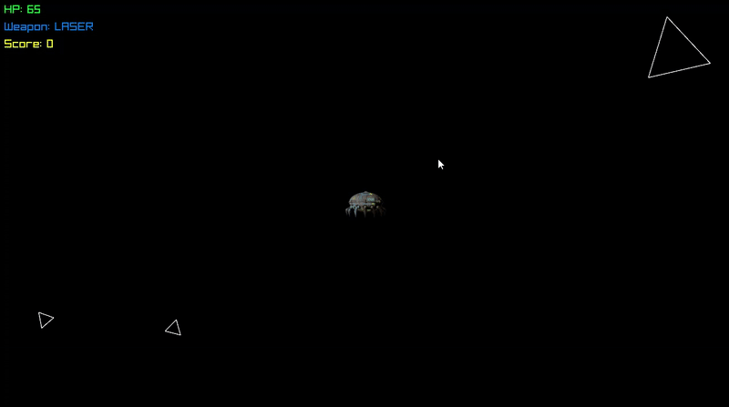

# AsteroidGame

> Simple asteroid game using C++  
> Skeleton of this project was made by **M.E. Kajetan Kruczkowski** from **Gdańsk University of Technology**  
> his project is part of an **educational lab assignment**.

---

## Version: `AsteroidGame - v_Lab1`

### Changelog:
- **Added HP system to asteroids**
- **Asteroids now first shrink to lower size, before getting destroyed**
- **Added TRIPLE weapon that shoots 3 projectiles**
- **Added option on "L" that switches textures of a spaceship**
- **Fixed an issue where size of a spaceship was based on its texture size**
- **Slowed a firerate of all weapons**
- **Added damage system to weapons**
- **Added scoring system**

---

